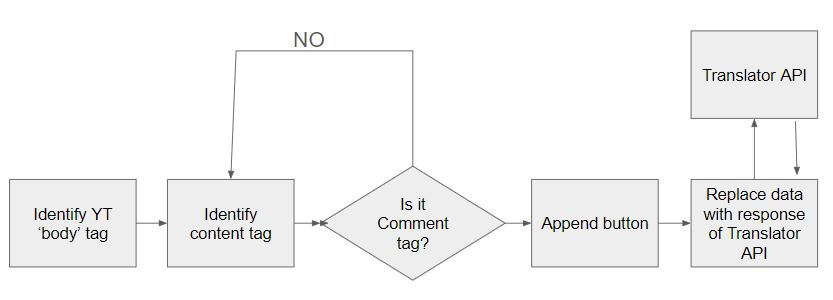

# Youtube translator
+ Translate YouTube comments using Google API or your own API
+ This exetention is a modified version of the one found [here](https://github.com/toluschr/YouTube-Comment-Translate).
+ This one works on Chrome : Version 125.0.6422.142
+ Architecture:
    + 
+ Manual Install : 
    + Enable Developer mode in chrome.
    + Navigate to My Extention and click on Load unpacked. 
    + Navigate to the folder you extracted to and click open.
    + Once done, disable Developer mode.
